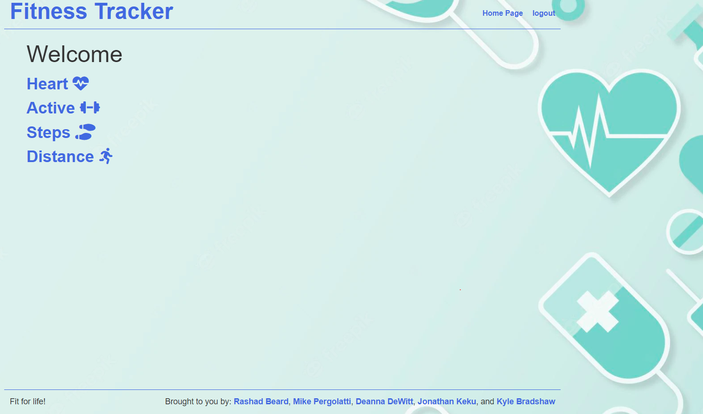

# Fitness Tracker Group Project 2

 ## Badges
  
  
  ## Table of Contents
  * [License](#license)
  * [Built With](#built-with) 
  * [Description](#description)
  * [Installation](#installation)
  * [Usage](#usage)
  * [How to Contribute](#how-to-contribute)
  * [Tests](#tests)
  * [Questions?](#questions)
  
  ## License
  Read more about MIT here:
  [MIT](https://opensource.org/licenses/MIT)

  ## Built With
  * Node.js
  * MYSQL
  * d3.js
  * JavaScript
  * Handlebars.js

  ## Description
  This application will allow a user to track their fitness goals through their phones. It will give  the user the ability to track their Heart Rate, Steps, Distance. It is a visual tool for users to be able to see when they achieve their fitness goals. Users will also have the ability to manually enter a value for a given day.

  

  ## Installation 

  In the cmd type in the following commands:

  npm init -y

  npm i connect-session-sequelize dotenv express-handlebars mysql2 express-session bcrypt sequelize express

  mysql -u <username> -p
  * Put in your password

  In the MySQL command line type:
  source db/schema.sql

  create a new file named .env in the root directory.  The folder should contain these variables, with the user name an password filled in for MySQL:
  DB_NAME='fitness_tracker_db'
  DB_USER=''
  DB_PW=''

  To seed the database type into the cmd:
  npm run seeds

  To run the server type into cmd:
  npm start

  ## Usage
  Register for an Account
  
  ## How to Contribute
  [Contributor Covenant](https://www.contributor-covenant.org/)  
  Not Applicable
  
  ## Tests
  Not Applicable
  
  ## Questions?
  ### Reach us here: 
  [Edward Beard](https://github.com/erbeard)
  [Michael Pergolatti](https://github.com/Mpergolatti) 
  [Deanna Dewitt](https://github.com/deanna-dewitt14)
  [Kyle Bradshaw](https://github.com/kabradshaw1)

